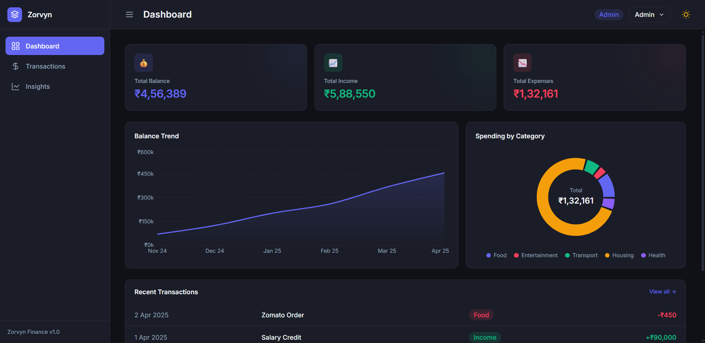
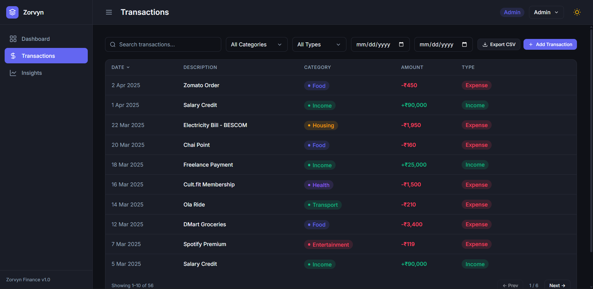
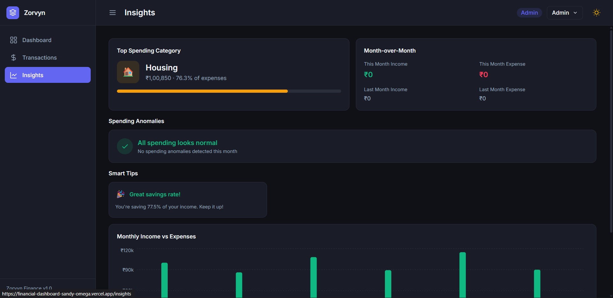

# Zorvyn Finance Dashboard

A production-quality Finance Dashboard web application built with modern React tools. Designed to help users track their income, expenses, and financial habits with a clean, SaaS-like interface inspired by modern enterprise tooling.

## Features

- **Instant Overview**: Dashboard with automated summary cards, progressive balance trends, and expense breakdown donut charts.
- **Frictionless Tracking**: Full CRUD support for transactions via a responsive, validated modal.
- **Advanced Filtering**: Filter transactions instantly by category, type, date range, and text search query.
- **Actionable Insights**: Month-over-month comparisons, top spending categories, and programmatic anomaly detection.
- **Role-Based Access (RBAC)**: Switch between 'Admin' (full write access) and 'Viewer' (read-only) modes instantly.
- **Premium UI/UX**: Custom design system using Tailwind CSS v4 with dark mode, smooth micro-animations, Recharts tooltips, and toast notifications.
- **Responsive**: Fully mathematically optimized for mobile, tablet, and desktop screens with adaptive flex/grid architecture.
- **Data Export**: Export your raw transaction matrices to CSV in a single click.

## Assignment Requirements Fulfillment

This repository was specifically architected to meet and exceed the core assignment criteria:
- **Dashboard Overview:** Implementations include calculating Total Balance, Income, and Expenses cards. Visualizations involve a 6-month Balance Trend Area Chart and a Categorical Spending Donut Chart.
- **Transactions Management:** Displays a comprehensive interactive list with instant text-search, timeline bounds, category filtering, and sorting functionality via table headers.
- **Simulated RBAC:** Instant toggling between `Admin` (grants full CRUD actions) and `Viewer` (forcefully removes all "Add/Edit/Delete" elements contextually from the UI).
- **State Management:** Implemented via **Zustand**, isolating logic into highly scalable domain-specific stores (`transactionStore`, `uiStore`, `roleStore`), bypassing messy prop-drilling.
- **Optional Enhancements Check:** Successfully integrated Dark Mode, `localStorage` Data Persistence, transition animations, CSV exporting, and advanced multidimensional filtering.
- **Edge-Cases:** Features custom-built `EmptyState` splash screens that trigger immediately upon clearing a database or filtering a matrix out of bounds, avoiding broken charts.

## Architecture & Tech Stack

- **Framework**: React 18 / Vite
- **Styling**: Tailwind CSS v4 (using root CSS Variables for strict theme tokens)
- **State Management**: Zustand (with persistent browser storage)
- **Routing**: React Router v6
- **Charts**: Recharts (with accessibility fixes applied)
- **Icons**: Lucide React

## Folder Structure

```text
src/
├── components/          # Scalable, reusable view layers
│   ├── dashboard/       # Dashboard specific graphs and cards
│   ├── insights/        # Analytics logic and anomaly displays
│   ├── layout/          # Global Sidebar, TopBar, Navigation
│   ├── transactions/    # FilterBar, Grid Tables, CRUD Modals
│   └── ui/              # Universal atomics (Buttons, Badges, Toasts)
├── data/                # Initial fallback mock seed logic
├── hooks/               # Custom lifecycle hooks (usePermission, useFilters)
├── pages/               # Primary browser route controllers
├── store/               # Zustand memory modules
└── utils/               # Formatting scripts and mathematical aggregators
```

## Setup Instructions

1. **Clone the repository** (if applicable) or navigate to the project directory.
2. **Install dependencies**:
   ```bash
   npm install
   ```
3. **Run the development server**:
   ```bash
   npm run dev
   ```
4. **Build for production**:
   ```bash
   npm run build
   ```

## Development Decisions & Polish

- **State Management**: Chose Zustand for global state to avoid prop drilling and provide easy `localStorage` persistence. Stores are rigorously separated by domain.
- **Styling**: Instead of basic utility classes scattered everywhere, `index.css` defines a strict set of design tokens (colors, shadows, radiuses) using Tailwind v4's `@theme` directive. Dark mode is fully integrated via class switching.
- **Derived State**: Used `useMemo` heavily in the custom `useFilteredTransactions` hook and analytical aggregators to ensure high layout calculation performance even with massive transaction arrays.
- **RBAC Security Simulation**: The `usePermission` custom hook evaluates the current active role and dynamically dictates which components, buttons, and datagrid columns are mathematically rendered to the DOM.

## Screenshots


*The main dashboard overview showcasing fully responsive, beautifully styled data cards and Recharts analytics.*


*The comprehensive transactions data matrix featuring instant search queries, categorical dropdown filters, and secure RBAC actions.*


*The Insights tab providing deep-dive analytical breakdowns, logic-based automated anomaly detection alerts, and cross-month fiscal comparisons.*